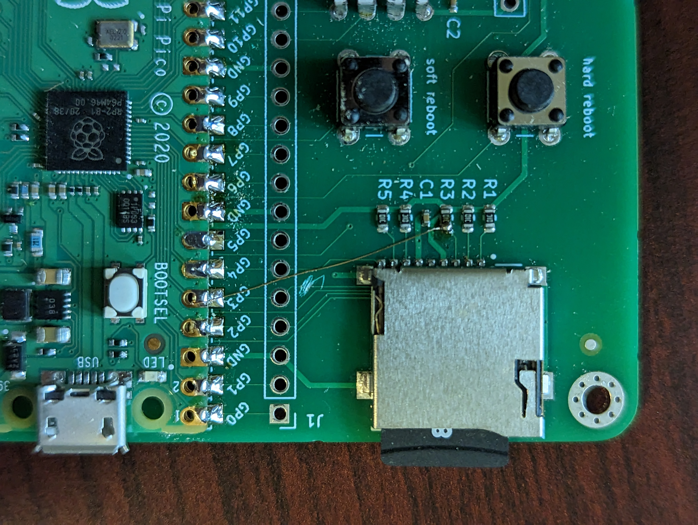

# DoorCounter
A IR beam detector for counting when people enter or exit a room, running on a Raspberry Pi Pico.

The DS1302 driver is from [Omar Benhamid](https://github.com/omarbenhamid/micropython-ds1302-rtc). Thanks Omar!

The rotary encoder driver is from [Mike Teachman](https://github.com/miketeachman/micropython-rotary). Thanks Mike!

The circuit board will be held in using 5/16 inch 2-28 pan-head screws. The heads have a diameter of 5/32 inches = 4 mm, The threaded portion has an exterior diameter of 3/32in = 2.3mm, and an inner diameter of about 1/16in = 1.6mm. They measure 3/8 inch in length, counting the head.

## Prototype error
Caution: in my first batch of boards I made an error in the schematic. Of course I take full responsibility, but I feel some blame shoudl also be shared by whoever decided to give one pin of the SD card the designation `DI` and another one the designation `D1`.

The error has already been fixed on the schematic, and it's easy enough to fix. Just break the trace going from `GP3` to the SD card, and instead run a wire to one side of `R3`. Like this:

Of course, if you don't use the SD card then this makes no difference. It is still pulled up to the `3V3` line with a 10k resistor.